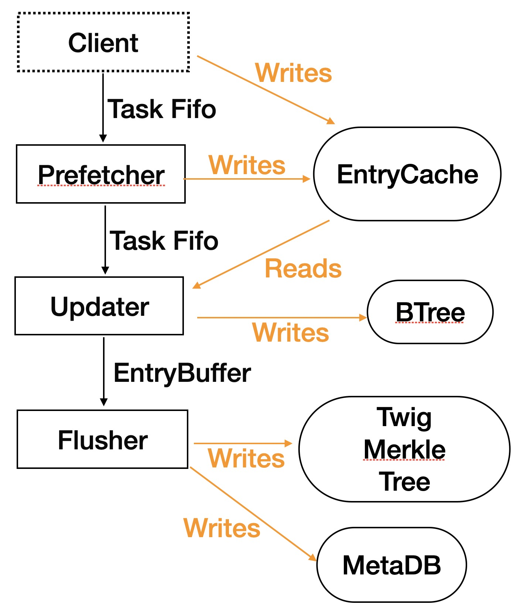
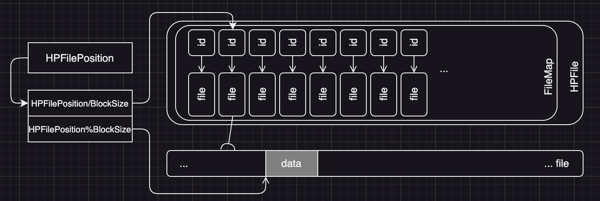
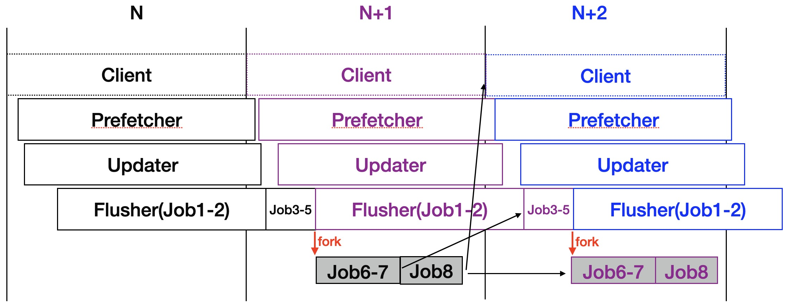

## QMDB's internal architecture

### Introduction to packages of qmdb

Here we introduce the data structures defined in the qmdb repo.

### The overall architecture

First we summerize the files in qmdb:

- hpfile.rs: HPFile is the base class of EntryFile and TwigFile.
- entryfile.rs: The EntryFile contains the leaves (i.e. entries) of the Twig Merkle Tree.
- twigfile.rs: The TwigFile contains the internal Merkle nodes of twigs.
- twig.rs: An in-memory representation of twigs.
- entry.rs: An in-memory representation of entries.
- tree.rs: Tree contains all the in-memory and in-SSD parts of the Twig Merkle Tree.
- indexer: An in-memory B-Tree to map keys to offsets of entries in entryfile.
- metadb.rs: MetaDB contains meta information about the Twig Merkle Tree.
- recover.rs: Recover the in-memory parts of the Twig Merkle Tree from in-SSD EntryFile and meta information.
- entrycache.rs: EntryCache acts as a disk cache, mapping entries' offsets-in-file to their contents. The client and prefetcher fills it such that updater can get the entries from memory, instead of from SSD.
- prefetcher.rs: It fills EntryCache with the entries which will be updated because of the deletion and creation of KV-paris.
- updater.rs: It updates btree according to the client's request and send change requests to flusher through EntryBuffer.
- entrybuffer.rs: It is a fifo of entries. Each entry also acts as a request to the flusher.
- flusher.rs: It gets requests from EntryBuffer and writes the in-memory and in-SSD parts of the Twig Merkle Tree. It also updates MetaDB.

The core of qmdb is the Prefetcher-Updater-Flusher pipeline, which is shown below:



The external client sends tasks to the Prefetcher through a task fifo. A task contains several operations to add/delete/update/create KV-pairs. Usally an EVM transaction is modeled as a task.

To update a KV-pair, the external client should fill the old entry into the EntryCache. To delete and create a KV-pair, the prefetcher should fill the old previous entry into the EntryCache, because its `NextKeyHash` field would be updated.

When a new block starts, the external client must send a new EntryCache together with the first task in the block, such that the prefetcher can write to it and the updater can read from it.

The prefecher deques a task from the task fifo, handles the deletion and creation operations in it, and then enques the task into another task fifo, which goes to the updater.

The updater deques a task from the task fifo, handles the updating, deletion and creation operations in it:

- Update
  1. read the old entry out and invalidate it
  2. change the entry's `Value`, `LastHeight` and `Height`, and recreate it as a new entry.
- Delete
  1. invalidate the old entry
  2. read the old entry's previous neighbor out and invalidate it
  3. change the entry's `NextKeyHash`, and recreate it as a new entry
- Create
  1. create the new entry
  2. read out the previous neighbor entry whose `NextKeyHash` must be changed because of the new entry, and invalidate it.
  3. change the entry's `NextKeyHash`, and recreate it as a new entry

The updater directly changes btree but it does not directly changes the Twig Merkle Tree. Instead, it sends change request to the updater through EntryBuffer.

The flusher get requests from EntryBuffer and do the following jobs:

- Job-1: Append new contents to EntryFile and TwigFile
- Job-2: Clear some ActiveBits to invalidate old entries
- Job-3: Calculate the roots of changed/added twigs
- Job-4: Evict the twigs which are no longer active
- Job-5: Flush EntryFile and TwigFile to SSD
- Job-6: Calcuate the Twig Merkle Tree's root using the twig roots as inputs, which may get changed by Job-3
- Job-7: Prune old twigs that are no longer needed
- Job-8: Update MetaDB

### Head-Prunable File



See hpfile.rs

Normal files can not be pruned(truncated) from the beginning to some middle point. HPFile use a sequence of small files to simulate one big file. Thus, pruning from the beginning is to delete the first several small files.

A HPFile can only be read and appended. Any byteslice which was written to it is immutable.

You can use `Append` to append a new byteslice into a HPFile, and `Append` will return the start position of this byteslice. Later you can pass this start position to `ReadAt` and read this byteslice out. The position passed to `ReadAt` must be the beginning of a byteslice, instead of its middle.

A HPFile can also be truncated: discarding the content from the given position to the end of the file. All the byteslices written to a HPFile during a block should be taken as one whole atomic operation: all of them exist or none of them exists. If a block is half-executed because of machine crash (some of the byteslices are written and the others are not), then the written slices should be truncated away.

### Entry File

See entryfile.rs

It uses HPFile to store entries, i.e., the leaves of the data tree. The entries are serialized into byteslices in such a sequence:

1. 1-Byte Key Length
2. 3-Byte Value Length
3. 1-Byte length of deactived serial number list
4. Variable-length Key
5. Variable-length Value
6. Padding zero bytes (to ensure an entry's total length is integral multiple of 8)
7. 32-Byte NextKeyHash
8. 8-Byte Height (little endian)
9. 8-Byte LastHeight (little endian)
10. 8-Byte SerialNumber (little endian)
11. The deactived serial number list: a list of 8-byte integers (little endian)

By adding list of deactived serial numbers into entries, we can also use an entry file as a log file. If all the information in memory is lost, we can re-scan the entry file from beginning to end to rebuild all the state.

An entry's hash id is sha256 of its serialized bytes, which means the list of deactived serial numbers is also proven by the merkle tree. If you receive an entry file from an untrusted peer, you can verify its entries with the merkle tree.

```


```

### The Twig File

See twigfile.rs

It uses HPFile to store small 2048-leave tree in a twig. When someone queries for the proof of an entry, we can use this file to read the internal hash nodes in the twig.

Each hash node occupies 32 bytes. There are 4095 nodes in the 2048-leave small Merkle tree, and they are numbered in such way:

```text
                               1                                        
                              /  \                                       
                             /    \                                       
                            /      \                                       
                           /        \                                       
                          /          \                                       
                         /            \                                       
                        2              3                                  
                       / \            / \                                    
                      /   \          /   \                                    
                     /     \        /     \                                    
                    4       5       6      7                             
                   / \     / \     / \    / \                                    
                  /   \   /   \   /   \  /   \                                    
                 8    9  10   11 12  13  14  15
```

Node 1 is the root, and 2 and 3 is its left child and right child. Generally, node `n` has `2*n` and `2*n+1` as its left child and right child. There is no node numbered as 0. The 2048 leaves in the tree are numbered from 2048~4095.

In the twig Merkle tree file, we also stores the first entry's position of each twig, which is the postion where we can find the first entry of a twig in the entry file. This information occupies 12 bytes: 8 bytes of position and 4 bytes of checksum.

### The Twig Merkle Tree

See tree.rs

This is most important data structures. Youngest twig, active twigs and pruned twigs are all implemented here. Most of the code are related to incrementally modify the Merkle tree by appending new leaves and invalidate old leaves.

#### Major Components

A datatree keeps the following major components:

1. The entry file
2. The twig file, which stores the left parts of all twigs, except the fresh twig
3. The left part of the fresh twig
4. The right parts of all active twigs (the right parts of the inactive twigs are all same and not needed to be kept)
5. The upper-level nodes whose are ancestors of active twigs

The components 3, 4 and 5 are stored in DRAM and volatile. They will be lost after the program exits, so their state must be rebuilt from components 1 and 2 when the program is restarted.

There are also some minor components, which are temporary sratchpad used during block execution. When a block is fully executed, the contents of these components will be cleared.

#### Buffering the left part of the fresh twig

The left part of a twig is a Merkle tree with 2048 leaves. When a new twig is allocated as the fresh twig, all its leaves are hashes of null entry, whose Key, Value and NextKey are all zero-length byteslices and Height, LastHeight and SerialNum are all -1.

As new entries are append into the fresh twig, more and more leaves are replaced by hashes of non-null entries. And the 2048-leave Merkle tree changes gradually. We record this gradually-changing left part of the fresh twig in the variable `mtree4YoungestTwig`.

After 2048 entries are appended, the left part can not change anymore, so we flush it into the twig file and then allocate a new small Merkle tree as the fresh twig.

#### Evicting twigs and pruning twigs

When a twig's active bits are all zeros, its right part can not change any more. So we can evict it from DRAM to make space for newly-generated twigs.

The aged twigs will undergo the compaction process, during which the valid entries are read out, invalidated and recreated. Compaction ensures we can always make some progress in evicting old twigs.

Pruning twigs is another operation, which is totally different from evicting. Pruning twigs means prune the entries and left parts of old twigs from SSD. The twig file and the entry file are all implemented with head-pruneable files, so they support pruning the records at the head.

#### Upper-level hash nodes

In datatree we use the variable `nodes` to store the upper-level nodes.

The variable `nodes` is just a hashmap, whose values are hash IDs stored in nodes, and keys are tree-positions. How to present the position of a node in a Merkle tree? If a node is the `N`-th node at level `L`, the its tree-position is calculated as an integer `(L<<56)|N`. A node with postion of `(L, N)` has two children: `(L-1, 2*N)` and `(L-1, 2*N+1)`.

A root node is the node whose level is the largest among all the nodes.

#### The null twig and null nodes

QMDB uses a balanced binary Merkle tree whose leave count is $2^N$. If the count of entries is not $2^N$, we just add null entries for padding, concepturally. In the implementation, we do not really add so many null entries for padding. Instead, we just add at most one null twig and at most one null node at each level. In a null twig, all the active bits are zero and all the leaves are null entries. For a null node, all its descendant (downstream) nodes and twigs are null. The null twig and null nodes are pre-computed in the `init()` function.

In the following figure. E is a null twig while F and G are null nodes. We do not keep the grey portion in DRAM and hard disk, because these twigs and nodes are all null. Instead, storing E, F and G in DRAM is enough to providing proof for every valid entry.


#### The edge nodes

In the above figure, the first four twigs are pruned to save space of hard disk. If we discard all the orange portion of the Merkle tree, some entries will be impossible to be proven. So we must still keep the nodes A, B, C and D in DRAM. These nodes are called "edge nodes" because they are at the left edge of the remained tree. A node is an edge node if and only if:

1. It is the twigRoot of just-pruned twig, i.e., whose twigID is the largest among all pruned twigs.
2. It has both pruned-descendants and non-pruned-descendants.

The edge nodes must be saved to MetaDB to keep data consistency.

#### Batch sync

The datatree gets changed because of two kinds of operations: appending new entries and deactivating old entries. If we synchronize the Merkle tree after each operation, the amount of computation would be huge. So we prefer to finish all the appending and deactivating operations in a block and then use batch-mode synchronization to make the Merkle tree consistent.

Synchronization has four steps:

1. When the left part of the fresh twig is ready to be flushed to hard disk, this 2048-leave tree get synchronized. This synchronization can run multiple times during a block's execution.
2. When a block finishes execution, the left part of the fresh twig get synchronized.
3. When a block finishes execution, all the right parts of twigs get synchronized to calculate twig root
4. When step 2 and 3 finish, the upper level nodes get synchronized.

During step 2, 3 and 4, the hash computations of the same level are independent with each other, so we can run them parallelly.

### Rocksdb

See rocks_db.rs

RocksDB is a KV database written in C++. It has a Rust binding.

All the updates generated during one block is kept in one db-batch, to make sure blocks are atomic. If the batch commits, the block commits. If the batch is discarded, it looks as if the block does not execute at all.

### metadb

See metadb.rs

We need to store a bit of meta information when a block finishes its execution. The data size is not large and not performance critical, so we store them in RocksDB.

When the program starts, we should use the information in metadb to recover the other parts of QMDB.

The following data are stored in metadb:

- CurrHeight: the height of the latest executed block
- TwigMtFileSize: the size of the twig Merkle tree file when the block at CurrHeight commits.
- EntryFileSize: the size of the entry file when the block at CurrHeight commits.
- OldestActiveTwigSN: serial number of the oldest active entry, i.e., this SN is the smallest among all the active entries.
- OldestActiveTwigFilePos: file position of the oldest active entry.
- LastPrunedTwig: ID of the  just-pruned twig, i.e., this ID is the largest among all pruned twigs.
- EdgeNodes: the edge nodes returned by `PruneTwigs`.
- NextSerialNum: the serial number that will be used when creating the next entry.

When QMDB is NOT properly closed, TwigMtFileSize and EntryFileSize may be different from the real file size on disk, because of the last block's partial execution. Before recovering, the twig file and entry file would be truncated to the TwigMtFileSize and EntryFileSize stored in metadb, respectively.

### B-tree

We use B-Tree because it's much more memory-efficient that Red-Black tree and is cache friendly.

It costs a lot of DRAM to use B-Tree to map 256-bit key hashes to 64-bit file offsets. So we just use B-Tree to map 64-bit short key hash to 48-bit file offsets.

The 64-bit short key hashes are just first 8 bytes of sha256 hashes. They are too short to prevent hash conflicts. So the B-Tree is actually a `ordered_multimap`-like data structure. One short key hash can be mapped to multiple file offsets. You must try all of them to figure out which is the correct one. Since hash conflicts is rare enough for 64-bit short hashes, the performance penalty can be ignored.

The 48-bit file offsets must be multiplied by 8 to get the real offsets to access EntryFile. Because the entries are padded to integral multiple of 8 bytes, their offset's lowest three bits are always zeros. The maximum size of EntryFile is `2**51 = 2048 Tera Bytes` when using such a B-tree.

The B-tree is divieded into 65536 shards to support parallel access from client/prefetcher/updater. Each shard maps 48-bit integers to 48-bit integers.

To prevent parallel-programming bugs caused by cross-shard iteration, when creating a Twig Merkle Tree, 63356 sentry entries must be inserted to it. Sentry entries' key hashes are not calculated, instead, they are defined to be `[32]byte{X, Y, 0, 0, 0, 0, 0, 0, 0, 0, 0, 0, 0, 0, 0, 0, 0, 0, 0, 0, 0, 0, 0, 0, 0, 0, 0, 0, 0, 0, 0, 0}` where X and Y are two 8-bit integers.

### Timing of the pipeline

The client must gradually send new tasks to the prefetcher through out the time frame of a block interval. The prefetcher/updater/flusher are allowed to finish their job within the time frame of two block intervals, as is shown below:



Three block intervals (Block N, Block N+1 and Block N+2) are shown in the figure. The prefetcher and the updater work in repeating threads, which means, after they finish the tasks in Block N, they will continue to do the tasks in Block N+1, and they never exit. The flusher is different. It does Job1-5 in repeating threads and does Job6-8 in forked one-time threads. After Job5 is done, the flusher forks new threads to do Job6-8. The new threads exit after Job6-8 are done. We choose such a scheme for better performance because Job6-8 of Block N+1 can be done concurrently with Job1-2 of Block N.

To prevent possible bugs, we add the following interlock requirements:

- Requirement-1: The forked one-time thread for Job6-8 can not overlap. The forked one-time thread of Block N must exit before the flusher fork the one-time thread of Block N+1.
- Requirement-2: Since Job3 will overwrite the twig roots read by Job6, the Job6 of Block N+1 cannot start before the Job3 of Block N finishes.
- Requirement-3: The client cannot start to execute Block N+2 (and later Blocks) before Job8 of Block N finishes.

The Requirement-3 ensures that the new data generated by Block N are written to SSD before Block N+2 starts. When the client executes Block N+1, it can only read the data written by Block N and earlier blocks from SSD reliably, and it must read the data written by Block N and Block N+2 from a local cache maintained by itself.

## TaskHub

QMDB and its client (such as exepipe) sync with each through TaskHub. QMDB needs to know how many tasks are in current block. TaskHub holds all the tasks in the recent two blocks.

The exepipe and QMDB are all pipelined. The total latency of a task getting scheduled, executed, writing file is no larger than two block intervals. This situation is possible: at some moment, the task processed by prefetcher is in Block#N+1 and the task processed by updater is in Block#N.

So the data in TaskHub can be divided into two sets: set 0 and set 1. Somehow it is like the "double buffering" scheme. The variable height0 and height1 are the two blocks whose tasks are held in TaskHub. Please note that height0 may be larger or smaller than height1. If height0 or height1 is -1, then set 0 or set 1 is empty, respectively. `start_block` fills an empty set. `end_block` releases (frees) a used set.

When QMDB finishes a block and updates metadb, the block's height will be sent to `end_block_chan`. The QMDB's cliet (such as exepipe) must check `end_block_chan` before calling `start_block` to make sure there is at last one empty set.  

TaskHub's `get_change_sets` function returns change sets, that is set of changes the task has make. In a change set, all the modifications are sorted in a determistic order, which is enforced by the logic in 'ChangeSet'.

## HybridIndexer

HybridIndexer wants to solve the problem of InmemIndexer using too much DRAM. DRAM is veriy expensive.

It puts most of indexing data in SSD, and a bit of data in DRAM, so we call it "hybrid".

It contains four parts:

1. Readonly disk files. It records indexing information (8-byte key and 6-byte entryfile offset) which were recorded before. Some of its data are up-to-date, and some are not.
2. Cache in DRAM. It records some results which were got after accessing the readonly disk files. As long as the readonly file is valid, the cached results are valid.
3. Overlay in DRAM. It records the latest add/delete/update operations.
4. ActiveBits in DRAM. It has the same function as the ActiveBits in UpperTree. However, it is updated by the flusher, instead of the updater.

The out-of-date indexing information in the readonly disk files can not make trouble because:

1. originally existing + now not exsiting: the `del_set` in Overlay will filter them out.
2. originally adjacent + now not adjacent: if a `prevEntry` is no longer adjacent to an `entry` (because of insertion between them or deletion of `prevEntry`/`entry`), the logic in updater will make `prevEntry` deactived, so `del_set` can filter them out too.
3. originally not existing + now existing: the `new_kv` in Overlay records them.
4. originally not adjacent + now adjacent: the `new_kv` in Overlay records them.

To prevent the cache from growing too large, we divide it into small ones. Each small cache only serves one single block. When the block it serves gets old, it will be deleted. So every time we access the HybridIndexer, the block's height must be given, to show the access requests are coming from this block's transactions. The access request coming from RPC do not belong to a transaction in block, so we use -1 as their heights. When HybridIndex gets requests of height -1, it will not read or update the cache.

To prevent Overlay from growing too large, we periodically merge Overlay and the old readonly files to generate new readonly files, and then clear the cache (because the old readonly files are invalid now).

Such a merging task is done by a dedicated merger thread. When the merger thead finds a shard has accumulated enough changes of add/delete/update, it merges this shard.

To avoid conflicts, HybridIndexer has 65536 small units inside. To serve a read/write request, we only lock one unit. Since the read request may also change the unit's cache, we just use Mutex, instead of RwLock.

We cannot asign a readonly file to each unit, because 65536 files are too many. Instead, we let 1024 units share one file. There are 64 files in total and each files is protected by a RwLock. During merging, the file is write-locked, which means the other 1023 units which are sharing this file cannot get a read-lock. To alleviate this problem, we use a big buffer to cache the write data, and only the short period of flushing this buffer needs the file's write-lock.

The readonly files are not designed for persistency. If the program crashes or exits, you must re-build these readonly files after restart the program. Rebuilding the readonly files of one shard needs to first generating their contents in DRAM and then flush them out to files. This process consumes quite a lot of DRAM, so we must rebuild one shard after another to keep the peek DRAM usage low.

The readonly files are implemented using `TempFile`. When no units are referencing a `TempFile`, it will be deleted from disk. Each record in the readonly file is 14 bytes long: 8-byte key and 6-byte file offset. All the records are sorted in ascending order, just like BTree in DRAM. During merging, we do not need to sort again. To make it easier to find a record in file, we keep a 8-byte key for every 256 records in disk.

### Cache Design

The cache is not used to containing some segment of the readonly files. Instead, it contains some results or facts about the readonly files, which are known after accessing the files. These facts are:

- Fact#1: We cannot find a file offset corresponding to a 8-byte key
- Fact#2: We can find a unique file offset corresponding to a 8-byte key
- Fact#3: We find the previous key of a 8-byte key Y is X, and we know the corresponding keys of X and Y

The Fact#1 and Fact#2 are used in read/write operations, while Fact#3 can be used in create/delete operations, as well as read/write operations. If we can find multiple file offsets corresponding to a 8-byte key, we just describe it as Fact#3 in the cache, although the previous key X is useless for this scenario.

In fact, when using 80-bit short hash prefix, one key has only one corresponding file offset in more than 99.99999% cases. But the code must support multiple corresponding offsets to be safe.

To analyze the cache's effectiveness, we count the times of cache-hit and cache-miss when the updater accesses it. When exepipe and prefetcher access the cache, we expect it will miss and get filled, so their accesses are marked as warmup=true. The accesses from updater are marked as warmup=false.

### ActiveBits help HybridIndexer

Both compactor and updater use the indexer's `key_exists` function to query whether an entry is active or not. Only active entries can be compacted. InmemIndexer judges this quickly by querying in DRAM whether the entry's file position can be found. But HybridIndexer cannot judge quickly by querying in SSD.

A better solution is to use UpperTree's ActiveBits instead. Considering Rust's ownership check, we cannot reuse the ActiveBits in UpperTree. Instead, we must add another ActiveBits owned by HybridIndexer.

HybridIndexer and InmemIndexer have the same API. Their functions' arguments can meet the needs of both of them. Some arguments are useless for HybridIndexer and some arguments are useless for InmemIndexer. However, all these arguments must be provided.

### Fetch Pages from Readonly Files

Each unit has its own key-offset pairs in readonly files. These pairs are grouped into pages. One page have 32 pairs. When filling information to the cache, we must fetch pages from readonly files and analyze them.

If a page contains two many pairs, it would use too much bandwidth of SSD and reduce the performance. Finally we find 32 is a reasonable value.

How do we know which page to fetch? Just use a first-key list, which contains the first key of each page. Given a key hash, use its byte2~9 to run binary-seach on the first-key list, you'll get the page id to fetch from readonly files.

To further reduce memory usage, we use two different lengths in the first-key list. If `pageid%4==0`, then the key is 8-byte-long (sha256's byte2~9). If `pageid%4!=0`, then the key is 4-byte-long (sha256's byte2~5).

Note that using short hash (sha256's byte0~9) in HybridIndexer will cause hash conflications. The current key hash's key-offset pairs may span multiple pages. The previous key hash's key-offset pairs may also span multiple pages. So we must start from the last page which may contain the pairs for current/previous key hash's pairs, and scan backward until the span range end.

## Get Proof Paths

In flusher, before we spawn a thread for updating UpperTree, we use a channel to collect the requests of `get_proof`. The requests are save to a field in UpperTree and for each request we also read a copy of 256-bit ActiveBits out.

The the UpperTree is taken out from self.tree:

```rust
        let mut upper_tree = UpperTree::empty();
        mem::swap(&mut self.tree.upper_tree, &mut upper_tree);
        let upper_tree_sender = self.upper_tree_sender.clone();
```

In the spawned thread, when it finishes updating UpperTree, it will send the tree back:

```rust
            upper_tree_sender.send(upper_tree).unwrap();
```

Before it sends the tree back, we processes the requests save in UpperTree and get the full proof paths, using the 256-bit ActiveBits that were copied before.
